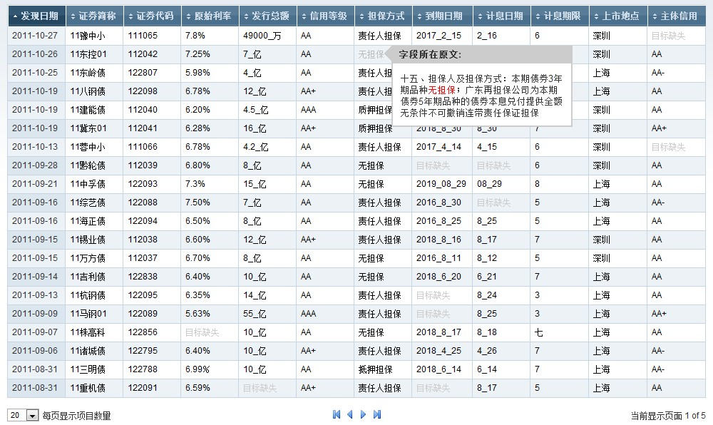
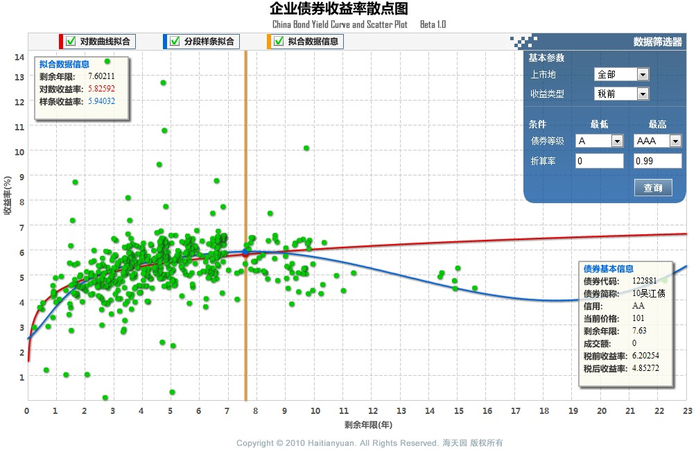

# msc-thesis

This repo archives programs that I developed in my master's thesis project 
"Automatic Information Extraction for China's Corporate Bond Market" in Harbin
Institute of Technology Shenzhen Graduate School. 
The purpose of this project is to develop a web application that
* Collect new bond information from online announcements 
  1. Download official bond anouncements online
  2. Convert PDF to text (PDFbox 1.3 in 2010 can't convert most Chinese PDF, so I wrote a more robust convertor in C++ on my own)
  3. Extract key information from the Chinese text
* Estimate bond yield curve for evaluating bond investment value
  1. Implement yield curve fitting in different methods
  2. Provide a interative tool at client side
  3. Request bond data and curve fitting service in a remote server

This web application was hosted in a colleage server and had a monthly visits of
5,000. Unfortunately, the applications are no longer being maintenanced so I decided
to host it here for my records.

## File Tree
<pre>
|-- <b>yield_curve_fitting</b>
|   |-- CurveFitting.cpp/CurveFitting.h <i>(C++ class for yield curve fitting)</i>
|   |-- mathfunc.cpp/mathfunc.h <i>(Linear algebra functions used by CurveFitting class)</i>
|   |-- php_curvefitting.cpp/php_curvefitting.h <i>(Convert CurveFitting to PHP extension)</i>
|-- <b>new_bond_prober</b>  
|   |-- <b>crawler</b>
|   |   |-- ...
|   |   |-- fileCrawler26.py <i>(Python class for Iincrementally downloadindg PDF annoucements)</i>  
|   |-- <b>pdf_miner</b>
|       |-- ...               
|       |-- InfoMiner.cpp/InfoMiner.h <i>(C++ class for info extraction from plain text)</i> 
|       |-- MySQL.cpp/MySQL.h <i>(A wrapper of MYSQL C++ connector)</i>   
|       |-- PDFParser.cpp/PDFParser.h <i>(C++ class for Chinese PDF convertion)</i> 
|-- <b>front_end</b>
|   |-- <b>client</b>
|   |   |-- scatter.php <i>(Client PHP page of the yield curve tool)</i>
|   |   |-- scatter.swf <i>(exported Flash of the yield curve tool)</i> 
|   |   |-- scatter <i>(Pics used in scatter.php)</i> 
|   |   |-- <b>flash_src</b>
|   |   |   |-- ... <i>(Actionscript codes that made the flash)</i>
|-- <b>back_end</b> 
|   |-- bondinfo_server.php <i>(Register curve fitting service in PHPRPC)</i>
|   |-- DBAccess.php <i>(A PHP wrapper of MYSQL connector)</i>
</pre>
## Yield Curve Demo
A local demo of yield curve flash can be opened at flash_src/scatter.swf

## Third Party Library
PHPRPC: http://www.phprpc.org/
## Screenshots

## History
Codes were written in 2010. No update will be made at this point.